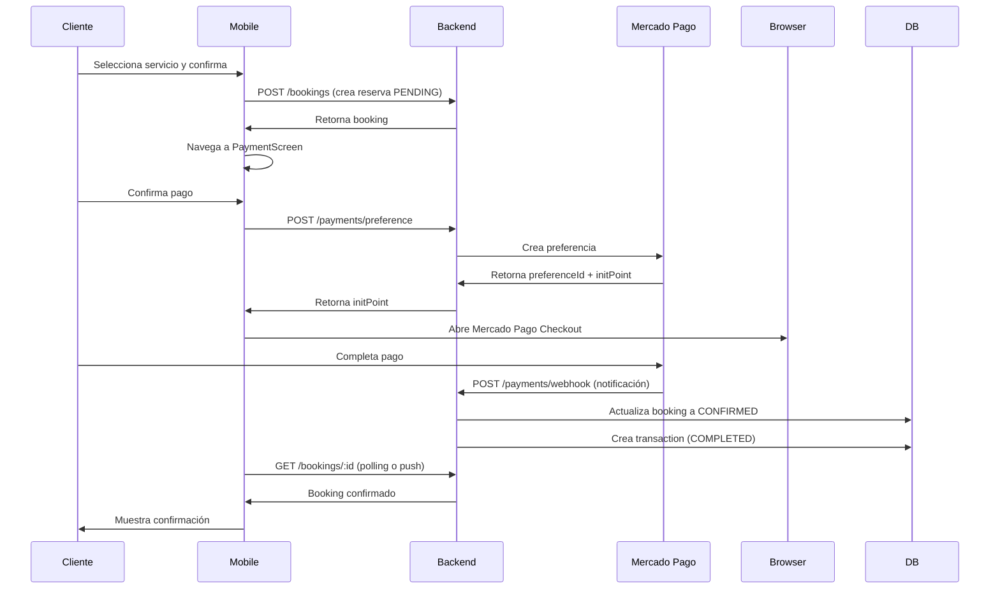

# Sistema de Pagos con Mercado Pago

Este documento describe la implementación del sistema de pagos con Mercado Pago para Guaumiau, que permite procesar pagos en Argentina y Colombia con comisiones automáticas.

## 📋 Tabla de Contenidos

- [Arquitectura](#arquitectura)
- [Configuración](#configuración)
- [Backend (NestJS)](#backend-nestjs)
- [Mobile (React Native)](#mobile-react-native)
- [Flujo de Pago](#flujo-de-pago)
- [Testing](#testing)
- [Producción](#producción)

---

## 🏗️ Arquitectura

### Modelo de Negocio

El sistema implementa un modelo de **Split Payment** donde:

1. **Cliente** paga el precio total del servicio + comisión de plataforma
2. **Plataforma** retiene automáticamente el 15% como comisión
3. **Paseador** recibe el 85% del precio base del servicio

### Ejemplo de Transacción

```
Servicio del Paseador: $100 ARS
Comisión de Plataforma (15%): $15 ARS
Total a Pagar: $115 ARS

Distribución:
- Paseador recibe: $100 ARS
- Plataforma retiene: $15 ARS
```

### Soporte Multi-País

- **Argentina**: Mercado Pago Argentina (ARS)
- **Colombia**: Mercado Pago Colombia (COP)

Misma implementación técnica, diferentes credenciales y monedas.

---

## ⚙️ Configuración

### 1. Variables de Entorno

Copia y configura las variables en `backend/.env`:

```bash
# Backend URL (para webhooks)
BACKEND_URL=http://localhost:3000

# Frontend URL (para deep links)
FRONTEND_URL=guaumiau://

# Argentina
MERCADOPAGO_AR_ACCESS_TOKEN=TEST-xxx-argentina
MERCADOPAGO_AR_PUBLIC_KEY=TEST-xxx-ar

# Colombia
MERCADOPAGO_CO_ACCESS_TOKEN=TEST-xxx-colombia
MERCADOPAGO_CO_PUBLIC_KEY=TEST-xxx-co
```

### 2. Obtener Credenciales de Mercado Pago

#### Modo Sandbox (Testing)

1. Ir a [Mercado Pago Developers](https://www.mercadopago.com.ar/developers)
2. Crear una aplicación
3. Obtener las credenciales de **TEST**:
   - `TEST-xxx` Access Token
   - `TEST-xxx` Public Key

#### Modo Producción

1. Completar el proceso de verificación de tu cuenta
2. Activar tu aplicación para producción
3. Obtener credenciales de **PRODUCCIÓN**

### 3. Configuración de Webhooks

Para recibir notificaciones de Mercado Pago:

1. En el dashboard de Mercado Pago, configura:
   - URL: `https://tu-dominio.com/payments/webhook`
   - Eventos: `payment` (obligatorio)

2. Para desarrollo local usa [ngrok](https://ngrok.com/):
   ```bash
   ngrok http 3000
   # Usa la URL de ngrok en BACKEND_URL
   ```

---

## 🔧 Backend (NestJS)

### Estructura de Archivos

```
backend/src/payments/
├── payments.module.ts           # Módulo principal
├── payments.controller.ts       # Endpoints de la API
├── payments.service.ts          # Lógica de negocio
├── payments.config.ts           # Configuración multi-país
└── dto/
    ├── create-payment.dto.ts
    ├── payment-response.dto.ts
    └── webhook-notification.dto.ts
```

### Endpoints Disponibles

#### `POST /payments/preference`
Crea una preferencia de pago (Checkout Pro).

**Request:**
```json
{
  "bookingId": "uuid-de-la-reserva"
}
```

**Response:**
```json
{
  "preferenceId": "123456789-xxx",
  "initPoint": "https://www.mercadopago.com/checkout/..."
}
```

#### `POST /payments/process`
Procesa un pago directo (si tienes el token de tarjeta).

**Request:**
```json
{
  "bookingId": "uuid-de-la-reserva",
  "paymentMethodId": "visa",
  "token": "card-token",
  "payerEmail": "cliente@email.com"
}
```

#### `GET /payments/public-key/:country`
Obtiene la clave pública de Mercado Pago para un país.

**Response:**
```json
{
  "publicKey": "TEST-xxx",
  "country": "AR"
}
```

#### `POST /payments/webhook`
Recibe notificaciones de Mercado Pago (webhooks).

### Servicio de Pagos

El servicio ([payments.service.ts](backend/src/payments/payments.service.ts)) maneja:

- ✅ Inicialización de clientes de Mercado Pago por país
- ✅ Creación de preferencias de pago
- ✅ Procesamiento de pagos directos
- ✅ Cálculo automático de comisiones
- ✅ Actualización de estado de reservas
- ✅ Registro de transacciones en base de datos
- ✅ Procesamiento de webhooks

---

## 📱 Mobile (React Native)

### Estructura de Archivos

```
mobile/src/
├── screens/PaymentScreen/          # Pantalla de pago
├── components/
│   ├── molecules/
│   │   └── PaymentMethodSelector/  # Selector de métodos de pago
│   └── organisms/
│       └── PriceBreakdown/         # Desglose de precios con comisión
├── hooks/payment/
│   └── usePayment.ts               # Hooks de React Query
└── services/api/
    └── payment.service.ts          # Cliente de API de pagos
```

### Componentes Principales

#### `<PaymentScreen>`
Pantalla principal para procesar pagos.

**Props:**
```typescript
{
  booking: Booking // Datos de la reserva
}
```

#### `<PriceBreakdown>`
Muestra el desglose de precios con comisión transparente.

**Props:**
```typescript
{
  serviceName: string
  servicePrice: number
  platformCommissionPercent: number // Default: 15
}
```

#### `<PaymentMethodSelector>`
Selector de métodos de pago (tarjeta, Mercado Pago, etc.).

**Props:**
```typescript
{
  selectedMethodId?: string
  onMethodSelect: (methodId: string) => void
}
```

### Hooks Disponibles

```typescript
// Crear preferencia de pago
const { mutate: createPaymentPreference } = useCreatePaymentPreference({
  onSuccess: (data) => {
    // Abrir data.initPoint en navegador/webview
  }
})

// Obtener clave pública
const { data: publicKeyData } = usePublicKey('AR')
```

---

## 🔄 Flujo de Pago

### Flujo Completo (Checkout Pro)



### Estados de la Reserva

```typescript
PENDING     → Reserva creada, esperando pago
CONFIRMED   → Pago aprobado, reserva confirmada
IN_PROGRESS → Servicio en progreso
COMPLETED   → Servicio completado
CANCELLED   → Cancelado
REJECTED    → Pago rechazado
```

### Estados del Pago

```typescript
PENDING     → Pago iniciado
PROCESSING  → Procesando
COMPLETED   → Pago exitoso
FAILED      → Pago fallido
REFUNDED    → Reembolsado
```

---

## 🧪 Testing

### Backend (Modo Sandbox)

1. Inicia el backend:
   ```bash
   cd backend
   npm run start:dev
   ```

2. Crea una preferencia de pago:
   ```bash
   curl -X POST http://localhost:3000/payments/preference \
     -H "Content-Type: application/json" \
     -H "Authorization: Bearer YOUR_JWT_TOKEN" \
     -d '{"bookingId": "uuid-de-reserva"}'
   ```

3. Abre el `initPoint` retornado en el navegador

4. Usa tarjetas de prueba de Mercado Pago:
   - **Aprobada**: `4509 9535 6623 3704` (VISA)
   - **Rechazada**: `5031 7557 3453 0604` (Mastercard)
   - CVV: 123
   - Fecha: cualquier fecha futura

### Mobile

1. Inicia la app:
   ```bash
   cd mobile
   npm run ios
   # o
   npm run android
   ```

2. Crea una reserva normalmente
3. En la pantalla de pago, selecciona Mercado Pago
4. Completa el flujo de pago con tarjetas de prueba

### Webhook Testing (ngrok)

```bash
# Terminal 1: Backend
npm run start:dev

# Terminal 2: ngrok
ngrok http 3000

# Usa la URL de ngrok en BACKEND_URL y en Mercado Pago dashboard
```

---

## 🚀 Producción

### Checklist de Producción

- [ ] Cambiar credenciales de TEST a PRODUCCIÓN
- [ ] Configurar webhook URL en Mercado Pago dashboard
- [ ] Configurar BACKEND_URL con dominio real
- [ ] Configurar FRONTEND_URL con deep link de producción
- [ ] Habilitar HTTPS
- [ ] Configurar rate limiting apropiado
- [ ] Implementar logs y monitoreo
- [ ] Configurar alertas para pagos fallidos
- [ ] Testear flujo completo en producción

### Variables de Entorno de Producción

```bash
NODE_ENV=production
BACKEND_URL=https://api.guaumiau.com
FRONTEND_URL=https://app.guaumiau.com

# Credenciales de PRODUCCIÓN
MERCADOPAGO_AR_ACCESS_TOKEN=APP_USR-xxx-real
MERCADOPAGO_AR_PUBLIC_KEY=APP_USR-xxx-real

MERCADOPAGO_CO_ACCESS_TOKEN=APP_USR-xxx-real
MERCADOPAGO_CO_PUBLIC_KEY=APP_USR-xxx-real
```

### Monitoreo

Revisa los logs para:
- Pagos exitosos/fallidos
- Webhooks recibidos
- Errores de API
- Tiempos de respuesta

```bash
# Ver logs del backend
tail -f logs/app.log

# Buscar errores de pagos
grep "Payment failed" logs/app.log
```

### Seguridad

- ✅ Credenciales en variables de entorno (nunca en código)
- ✅ HTTPS obligatorio en producción
- ✅ Validación de webhooks (firma de Mercado Pago)
- ✅ Rate limiting en endpoints de pago
- ✅ Logs de todas las transacciones

---

## 📊 Base de Datos

### Modelo `Transaction`

```prisma
model Transaction {
  id                    String          @id @default(uuid())
  bookingId             String?

  type                  TransactionType // PAYMENT, REFUND, PAYOUT
  amount                Float
  currency              String          // ARS, COP

  serviceFee            Float           // Lo que recibe el proveedor
  platformCommission    Float           // Lo que retiene la plataforma
  processingFee         Float

  paymentProvider       String          // "mercadopago"
  externalTransactionId String          // ID de Mercado Pago
  status                PaymentStatus   // PENDING, COMPLETED, etc.

  description           String?
  metadata              Json?

  createdAt             DateTime
  completedAt           DateTime?
}
```

### Consultas Útiles

```typescript
// Total recaudado por la plataforma
const totalCommissions = await prisma.transaction.aggregate({
  where: {
    type: 'COMMISSION',
    status: 'COMPLETED',
  },
  _sum: {
    platformCommission: true,
  },
})

// Pagos pendientes
const pendingPayments = await prisma.booking.findMany({
  where: {
    paymentStatus: 'PENDING',
  },
})
```

---

## 🛠️ Troubleshooting

### Error: "Payment client not configured"

**Causa:** Credenciales de Mercado Pago no configuradas.

**Solución:**
```bash
# Verifica que las variables estén en .env
cat .env | grep MERCADOPAGO

# Reinicia el servidor
npm run start:dev
```

### Error: "Webhook notification failed"

**Causa:** URL del webhook no accesible.

**Solución:**
- En desarrollo: usa ngrok
- En producción: verifica que BACKEND_URL sea accesible públicamente

### Pago aprobado pero reserva no confirmada

**Causa:** Webhook no procesado correctamente.

**Solución:**
```bash
# Ver logs de webhooks
grep "webhook" logs/app.log

# Verificar en Mercado Pago dashboard si el webhook fue enviado
```

---

## 📚 Referencias

- [Mercado Pago Docs](https://www.mercadopago.com.ar/developers)
- [Mercado Pago SDK Node.js](https://github.com/mercadopago/sdk-nodejs)
- [Tarjetas de Prueba](https://www.mercadopago.com.ar/developers/es/docs/checkout-api/testing)
- [Webhooks de Mercado Pago](https://www.mercadopago.com.ar/developers/es/docs/your-integrations/notifications/webhooks)

---

## 🤝 Soporte

Para dudas sobre el sistema de pagos:

1. Revisa este documento
2. Revisa los logs del backend
3. Consulta la documentación de Mercado Pago
4. Contacta al equipo de desarrollo

---

**Última actualización:** 2025-01-20
